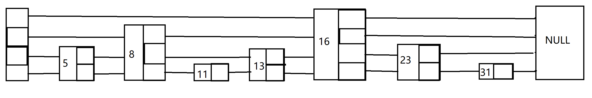

##### SkipList 跳表

#### 一、What's SkipList？

**SkipList**可以认为是优化过的链表。通过一个数据域搭配多个指针域，能够实现类似与二分查找的效果，将原来链表的`O(N)`的时间复杂度，优化到`logN`

同时为了避免`logN`的时间复杂度在插入或者删除的过程中退化（各个节点一样高的话，就会退化成链表），采取随机数的方式，来决定每一个节点的高度。当然也并不是随便什么数都可以拿来当作高度，我们还引入了一个`[0,1]`的增长概率p，来保证既能防止跳表在插入、删除过程中退化为俩表，又能将节点的高度控制在合理的范围内

#### 二、跳表查询的过程



比如在上面的跳表中，我们去查询11。

1. 首先从最上面一层开始，找到16，发现比11大，说明11如果存在的话，那么一定在头节点到16之间，16之后的就都不用查找了
2. 接下来找第二层，找到8，发现比11小，说明11存在的话就一定在8和16之间，头节点到8之间就不用找了
3. 然后找地三层，找到13，发现比11大，说明11存在的话就一定在8和13之间
4. 找第四层，找到11

**总结**：不难发现，跳表每次查找，都会抛弃掉一部分一定不会存在结果的查找，就像二分查找一样，每次都会抛弃一半的遍历，不过这里并不一定是一半，更多更少都有可能

#### 三、跳表的效率如何保证？

1. 前面提到过，可能会出现增加、删除节点导致跳表退化为链表的的情况，比如上面图中，删除所有高度为1、3、4的节点，就会造成这种结果；而我们增加的话，也很难去直接确定某个节点的位置最适合多高。
2. 所以我们采取了比较大胆的解法，引入一个随机数，和一个增长概率p。通过两者结合的方式，来决定一个节点的高度。用一份代码来解释的话：

```cpp
srand(time(0)); double p = 0.25; int max_level = 32;
int level = 1;
while(rand() <= RAND_MAX * p && level <= max_level)
{
    level++;
}
return level;
```
